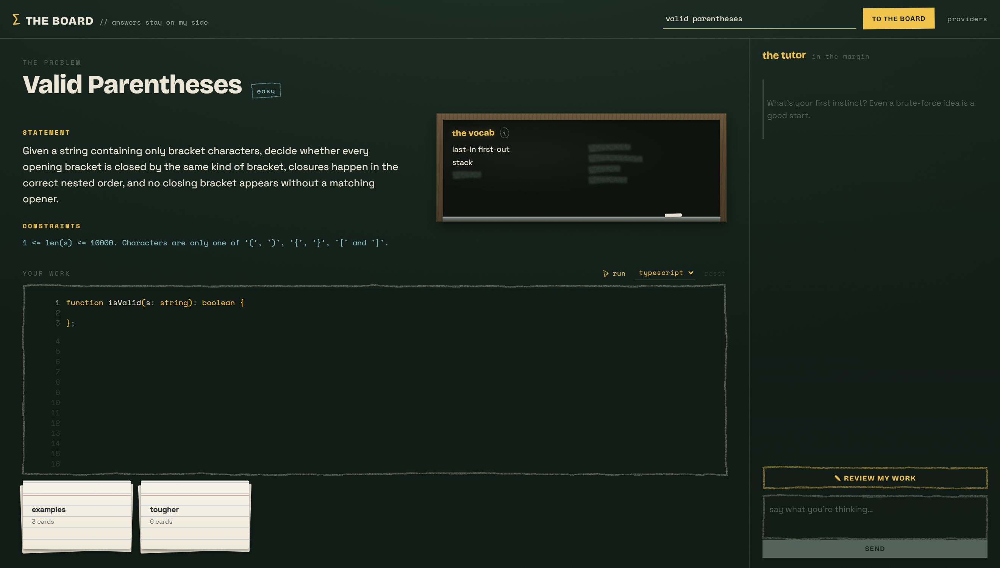

# The Board — a Socratic coding tutor

A coding-problem tutor that leads you to the answer and **never hands it
over**. You give it a problem (a name or a LeetCode link), it builds a
code-verified answer key it keeps to itself, and then it teaches: questions in
the margin, one rung at a time, de-escalating to analogies or faded scaffolds
when you're truly stuck — and refusing to reveal the solution even when you
beg. The whole product is *withholding done well*.



## How it teaches

- **The mode dial** — every tutor reply declares a mode: `socratic` (questions
  only), `analog` (teach the missing primitive on a simpler problem, then
  bridge back), or `scaffold` (faded pseudocode with holes). A separate
  **gate** model vets every reply — mode-aware — and forces a redraft when the
  teacher gives too much away.
- **The vocabulary** — a blackboard of the concepts the problem is built on.
  Words the tutor won't say yet are smudged out; commit to an idea of your own
  and the word gets written in. (An unlock judge distinguishes committing from
  fishing.)
- **The cases** — the problem's examples as ruled flash cards in two stacks.
  Click a stack and the cards fan out like a hand; runs stamp pass/fail onto
  them. "Chalk up tougher cases" has the model propose adversarial inputs
  whose expected outputs come from *executing the verified reference* — never
  from the model's say-so.
- **Run your code** — execute your buffer against the cases in python /
  typescript / javascript / c#, right under the editor, with per-attempt
  history you can check out like takes.
- **Gestures** — the tutor can touch the board: point a chalk arrow at a line
  of your code (quote-verified against your real buffer), deal a case card
  into the conversation, or tap the vocabulary board. Scaffold pseudocode
  renders its holes as inline inputs you fill and send back.
- **The tutor reads your board** — each turn, the teacher gets your live
  editor buffer as a file plus a one-line status (attempt · passing · last
  failing case). It teaches against what you actually wrote.

Everything answer-shaped stays server-side. The client is sent student-safe
data only, always.

## Install (Windows)

Grab **The Board Setup** from [Releases](../../releases) — pick per-machine
(Program Files) or per-user at install time; your data lives in
`%APPDATA%\The Board` either way. A portable exe is also attached.

The app brings its own runtime, editor, and language tooling for the UI — but
the tutoring and code-running lean on tools from your machine:

| Tool | Needed for |
|------|-----------|
| `codex` and/or `claude` CLI on PATH | the tutor itself (teacher/gate/unlock/ingest run through your CLI subscription — no API keys) |
| `python` on PATH | running your code, case extraction, the stress-case oracle |
| `dotnet` SDK + `csharp-ls` (`dotnet tool install -g csharp-ls --version 0.20.0`) | C# runs + C# language smarts (optional) |

## Development

```bash
npm install            # root, then also in engine/ server/ web/ desktop/
npm run desktop        # the app: api + vite + frameless Electron shell
npm run dev            # browser mode: api :8787 + web :5173
npm run dist           # build the installer into desktop/release/
```

Requires Node ≥ 22.5 (`node:sqlite`). First novel problem takes ~30–60s to
ingest; cards cache in `cards/` (seeded from `seed-cards/`).

## Layout

| Path | What |
|------|------|
| `engine/` | The headless tutor loop: unlock judge → teacher (+gesture) → gate → redraft. LLM backends shell your `codex` / `claude` CLIs. |
| `server/` | Zero-dep `node:http` API. Owns the answer key, persistence (`node:sqlite`), LSP bridges, code runs, teacher scratch. |
| `web/` | "The Board" UI — Vite + React, Monaco (bundled, offline), chalk design language. |
| `desktop/` | Electron shell + electron-builder packaging (NSIS + portable). |
| `prompts/`, `schema.json` | Teacher / gate / unlock / ingest / stress templates and the problem-card schema. |
| `seed-cards/` | The committed, code-verified starter problems. |
| `docs/` | Design docs — [`gestures.md`](docs/gestures.md), desktop debugging. |
| `prototype/` | The original bash harness + transcripts that proved the concept. |

`DESIGN.md` has the architecture and validation findings; `HANDOFF.md` is the
living state doc.

## The rules the product keeps

1. The answer key never reaches the client.
2. Stress cases never gate "solved" — official examples only.
3. Anything generated is verified by execution or dropped.
4. The tutor never types in your editor. It points; you write.
